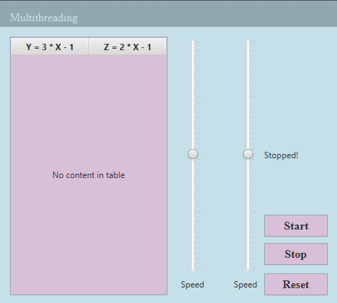
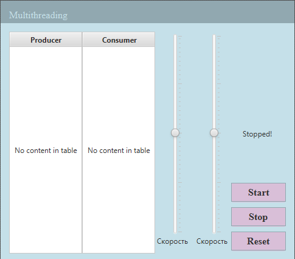

# Многопоточность
# Содержание
#### 1. [Формулировка задач](#form)
#### 2. [Первая задача](#first)
#### 3. [Вторая задача](#second)
#### 4. [Структура проекта](#struc)

# <a name="form">Формулировка</a>
## Задача 1
C помощью ``семафорных примитивов`` организовать работу ``параллельных вычислительных потоков``. 
+ Первый поток считает значение функции $y = 3x - 1$, $x$ принадлежит диапазону $(3;6)$ с шагом $1$, и значение функции $z = 2x - 1$, затем создает окно с количеством строк ввода равным $x + z$. 
+ Второй поток создает окно с количеством кнопок равным $y$. 

## Задача 2
Задачу о производителе и потребителе с ограниченным буфером решить с помощью ``алгоритма Деккера``.

---
# Реализация

## <a name="first">Первая задача</a>

Решение данных задач по многопоточности сделаны при участии графических интерфейсов, далее `GUI`

`GUI` для первой задачи выполнен следующим образом:

### Структура интерфейса для первой задачи

Проект представлен в виде небольшого окна, имеющего в себе:
+ 3 кнопки (Старт, Стоп, Сброс).
+ Таблицу с двумя колонками для демострации решения функций.
+ "Слайдеры" для изменения скорости работы двух потоков.
+ Метки для демонстрации текущей скорости работы (в милисекундах) и показа статуса Стоп при нажатии на соответствующую кнопку.

### Алгоритм работы решения первой задачи

Основной алгоритм работы интерфейса:
1. При инициализации окна задаётся стартовая скорость которая хранится в отдельных переменных, взятая со слайдеров.
Создаются ссылки на потоки, указывающие в свою очередь на методы решения различных задач. И создаётся коллекция список для хранения окон.
2. При нажатии кнопки `Start` проверяется не помечались ли потоки флажком "Смерти", далее если нет, то стартуют, если помечены, то инициализируются снова.
3. При нажатии кнопки `Stop` создаются эти самые флажки для двух потоков.
4. При нажатии кнопки `Reset` сначала очищается таблица до исходного состояния и при помощи выше указанной коллекции убиваются все окна с кнопками и строками ввода.

Алгоритм решения задачи. 

Первый поток выполняет следующие действия:
1. Пока поток не помечен флажком решаются функции по заданной формуле с шагом $1$ и если $x > 6$, то $x$ снова будет равен $1$.
2. Создаются поля в таблице.
3. Поток уходит в "сон" равный $5000 * (sliderValue / 100)$ милисекунд.
4. Семафор замирает.
5. Создаются окна с строками ввода равным $x + z$.
6. Семафор реализуется.

Второй поток выполняет следующие действия: 
1. Поток работает пока не помечен флажком.
2. Поток уходит в "сон" равный $5000 * (sliderValue / 100)$ милисекунд.
3. Семафор замирает.
4. Создаются окна с кнопками равным $y$
5. Семафор реализуется.

## <a name="second">Вторая задача</a>
`GUI` для второй задачи выполнен следующим образом:

### Структура интерфейса для второй задачи

Проект представлен в виде небольшого окна, имеющего в себе:
+ 3 кнопки (Старт, Стоп, Сброс).
+ Две таблицы по одной колонке в каждой для демонстрации работы Производителей и Потребителей.
+ "Слайдеры" для изменения скорости работы двух потоков.
+ Метки для демонстрации текущей скорости работы (в милисекундах) и показа статуса Стоп при нажатии на соответствующую кнопку.

Основной алгоритм работы интерфейса:
1. При инициализации окна задаётся стартовая скорость которая хранится в отдельных переменных, взятая со слайдеров.
Создаются ссылки на потоки, указывающие в свою очередь на методы решения различных задач.
2. При нажатии кнопки `Start` проверяется не помечались ли потоки флажком "Смерти", далее если нет, то стартуют, если помечены, то инициализируются снова.
3. При нажатии кнопки `Stop` создаются эти самые флажки для двух потоков.
4. При нажатии кнопки `Reset` очищаются таблицы.

>Алгоритм решения второй задачи выполнен идентично решению первой только для синхронизации работы потоков используется алгоритм Деккера.

# <a name="struc">Структура проекта</a>

- controllers 🎮
  - **MainController** - Контроллер для интерфейса первой задачи
  - **ProducerConsumerController** - Контроллер для интерфейса второй задачи

- models 🔭
  - **MathData** - Класс для представления математических данных для таблицы решения первой задачи
  - **ProducerData** - Класс для представления данных для таблицы продюссера
  - **ConsumerData** - Класс для представления данных для таблицы консюмера
  - **BufferData** - Класс для представления данных для таблицы буффера

- **MainApplication** - Основной класс работы JavaFX приложения

- **module-info.java**- подключенные модули для работы JavaFX
